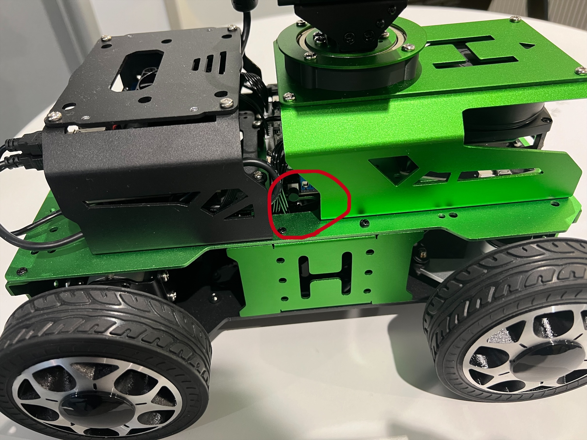

<!--
 * @Date: 2025-01-24
 * @LastEditors: JJQ jj1623@ic.ac.uk
 * @LastEditTime: 2025-02-16
 * @FilePath: /ELEC70120/Lab3_hiwonder/Robot.md
 * @Description: 
-->

# Robot User Guide

## Table of Contents

- [Robot User Guide](#robot-user-guide)
  - [Table of Contents](#table-of-contents)
  - [Introduction](#introduction)
    - [Overview of the Robot](#overview-of-the-robot)
    - [Technical Specifications](#technical-specifications)
    - [Glossary of Terms](#glossary-of-terms)
    - [Key Features and Specifications](#key-features-and-specifications)
    - [Safety Instructions](#safety-instructions)
  - [Getting Started](#getting-started)
    - [Powering On/Off](#powering-onoff)
    - [Remote Connection](#remote-connection)
    - [Software Setup](#software-setup)
      - [Step 1: Set up the Docker Container](#step-1-set-up-the-docker-container)
    - [Step 2: Check the Connection](#step-2-check-the-connection)
    - [Step 3: Operating the Robot: Manual Control](#step-3-operating-the-robot-manual-control)
  - [Advanced Development](#advanced-development)
  - [FAQs](#faqs)
    - [Common Questions and Answers](#common-questions-and-answers)

## Introduction

### Overview of the Robot

This guide provides a comprehensive overview of the robot's functionalities, hardware, and software. It is designed for users to get started, operate, and maintain the robot effectively.

### Technical Specifications

Processor: Jetson Nano

Sensors: LiDAR, RGB-D camera

Battery: 14.8V, 5200mAh

### Glossary of Terms

LiDAR: Light Detection and Ranging.

RGB-D Camera: A camera that captures both color (RGB) and depth (D) information.

### Key Features and Specifications

- High-precision LiDAR for mapping and navigation.
- RGB-D camera for object recognition.
- Jetson Nano for edge computing tasks.
- Maximum velocity: 1.5 m/s.
- Battery life: Up to 4 hours of operation.

### Safety Instructions

Static electricity can damage delicate electronic components. To avoid this, always remember to ground yourself before handling the robot or its components. Avoid touching the circuit boards directly and handle them by the edges.

When charging the robot, make sure to use the charger provided by the manufacturer. Avoid overcharging the battery as this can reduce its lifespan. The charging area should be dry and well-ventilated to prevent overheating. Always power off the robot before charging it.

## Getting Started

[](fig_system)
(should have a figure in here about the whole system)


### Powering On/Off

Place the robot on a flat and smooth surface, and
press the power button to turn the robot on or off.



The blue LED1 on the bottom right of the expansion board will light up and
keep blinking. At this moment, only the network configuration service is
enabled, but ROS and other services have not yet completed this process.
Wait for a short while.

> **Important Note:**
> 
> Before powering on the robot, ensure it is placed on a flat, stable surface to prevent accidental movements that could cause damage or injury. Verify that all connections are secure and there are no obstructions in the robot's path.


### Remote Connection

Connect to the Wi-Fi network of the robot. 
The name of the network is `hiwonder_{xxxxx}` 
and the password is `hiwonder`.

Remember to find the IP address of your local machine.
You can find the IP address by running the following command in the terminal.

```shell
ifconfig
```


### Software Setup

To get the ROS messages from the robot,
we need to set up the Docker container for the robot.

#### Step 1: Set up the Docker Container

Change the IP address in the `docker-compose.yml` file (line 31) to the IP address of your local machine.

```yaml
...
   - ROS_IP={your IP address}
...
```


On your local machine, run the following command to pull the Docker image from Docker Hub.

```shell
cd {your path to the Lab3 on local machine}
docker-compose up
```


> **Important Note:**
> 
> In the future development of your autonomous driving system, you may need to install some packages in the container according to your own requirements.
> If you need to install some packages, please **connect to the public network (not the robot)**, since the robot's network is isolated from the public network.

### Step 2: Check the Connection

After setting up the docker container, you can check the connection between the robot and the local machine by running the following command in the terminal.

```shell
rostopic list
```
You should see the list of topics published by the robot.
Take a look at the topics and make sure the robot is publishing the necessary information for your application.

```shell
rostopic hz {topic name}
```

An example of the image topic is `/hiwonde/rgb/c`.
You can view the image by running the following command in the terminal.

```shell
rqt_image_view
```
Then select the topic `/hiwonde/rgb/c`.
You should see the image published by the robot.


### Step 3: Operating the Robot: Manual Control

Copy the keyboard control package to the src folder of your workspace on your local machine.
Follow the same procedure in Lab1 to run the keyboard control package.

## Advanced Development

Now that you have successfully set up the robot and established a connection with your local machine, you can start developing advanced features such as autonomous navigation, object recognition, and path planning.

As a preliminary version, you can run all the packages on your local machine and send the commands to the robot through the network. However, these could cause a delay in controlling the robot.

<!-- ## Advanced Features

### Enable High Performance Mode

To maximize computational efficiency, enable the high-performance mode through the settings menu. This may increase power consumption and should be used judiciously. -->


<!-- ```shell
sudo jetson_clocks
``` -->

## FAQs

### Common Questions and Answers

- **Q: What should I do if the robot doesn't start?**
  **A:** Check the battery level and ensure the power button is pressed for 3 seconds.

- **Q: How do I reset the robot?**
  **A:** Press and hold the reset button for 5 seconds.
